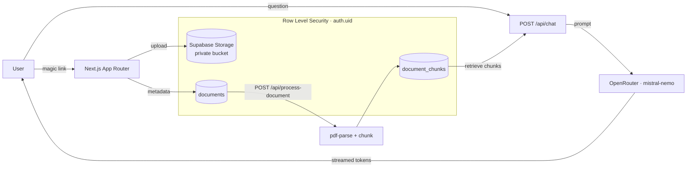

# AI Document Assistant

**Upload a document, ask questions about it.** A multi-tenant app where user data isolation is enforced by Postgres Row Level Security — not by application code.

[](https://github.com/Elmessiry/AI-Doc-Assistant/actions/workflows/ci.yml)


<!-- TODO(Day 6): record a 5–10s screen capture of upload → chat and drop it here.
     Use ScreenToGif/Kap/Peek, save to docs/demo.gif. This is the first thing a
     visitor sees — worth more than any paragraph below. -->
<!--  -->

<!-- TODO(Day 6): once deployed, add the live link:
     **Live:** https://<your-domain> — sign in with any email to receive a magic link. -->

## Why I built this

Most "chat with your PDF" demos put tenant isolation in application code — a `where user_id = ?` the developer has to remember on every query. I wanted to see whether the database could enforce it instead, so a forgotten filter fails closed rather than leaking another user's files. It can: every table and storage object is gated by Row Level Security keyed on the caller's JWT, and the frontend never filters by user at all.

## How it works

The frontend asks for "all documents" and the database returns only the caller's, because every request carries the user's JWT and the RLS policies key on `auth.uid()`. Files live in a private Storage bucket under a `<user-id>/` path, so one user can't reach another's files even with a direct API call. Uploaded PDFs are parsed, chunked, and stored; a question retrieves that document's chunks and streams a grounded answer back token by token.



**Stack:** Next.js 16 (App Router) + TypeScript · Supabase (Postgres, Auth, Storage, RLS) · OpenRouter (LLM) · Sentry + PostHog (observability) · Playwright (E2E) · Vercel.

## Features

- **Passwordless auth** — magic-link sign-in, protected dashboard via middleware.
- **Multi-tenant by construction** — RLS on every table and storage object; no app-level tenant filtering.
- **Document pipeline** — PDF text extraction, overlapping chunks, per-document processing status.
- **Grounded chat** — retrieval over a document's chunks, streamed answers, conversation history.
- **Rate limiting** — per-user caps on uploads and chat, enforced at the database.
- **Observability** — Sentry error monitoring and PostHog product analytics, both privacy-scoped (no message or document text leaves the app).

## Getting started

```bash
npm install
```

Create `.env.local`:

```bash
NEXT_PUBLIC_SUPABASE_URL=https://<your-project>.supabase.co
NEXT_PUBLIC_SUPABASE_ANON_KEY=<your-anon-key>
OPENROUTER_API_KEY=<your-openrouter-key>
# Optional (observability): NEXT_PUBLIC_POSTHOG_PROJECT_TOKEN, NEXT_PUBLIC_POSTHOG_HOST
```

In Supabase: enable the Email (magic-link) provider, create a **private** bucket named `documents`, and create the `documents`, `document_chunks`, `messages`, and `chat_requests` tables with RLS. Then:

```bash
npm run dev
```

## Testing

One Playwright end-to-end test drives the whole flow — sign in, upload a fixture PDF, wait for processing, ask a question, and assert the answer is grounded in the document.

```bash
# see .env.test.local.example for the extra vars the test needs
npm run test:e2e
```

Because magic-link auth can't be clicked in a headless browser, the test seeds a session using the Supabase service-role key. It runs on every push via GitHub Actions.

## Architecture decisions

- **Supabase over a hand-rolled backend** — Postgres, Auth, Storage, and RLS in one place meant tenant isolation could live in the database instead of scattered across app code.
- **RLS for multi-tenancy, not `where user_id`** — authorization enforced by the database fails closed. A missing filter in app code can't leak data because the policy still applies.
- **Overlapping chunks** — chunks share a 50-token overlap so an answer to a question spanning a chunk boundary isn't split in half.
- **Naive retrieval before pgvector** — small documents fit entirely in context, so v1 sends all of a document's chunks. Semantic retrieval with embeddings is the documented upgrade path, triggered when documents outgrow the context window.
- **Database-level rate limits** — counting in Postgres (not in-memory) means the limit holds across serverless instances that don't share memory.

## Roadmap

- [x] Magic-link auth + protected dashboard
- [x] Private uploads with row-level security and per-user rate limiting
- [x] PDF parsing + chunking
- [x] Chat with retrieval (RAG), streaming, and history
- [x] Observability (Sentry + PostHog)
- [x] End-to-end test + CI
- [x] Deploy to a custom domain
